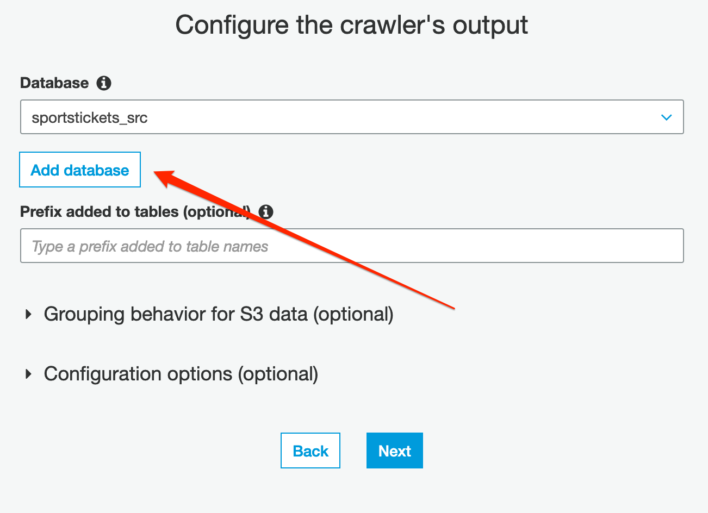
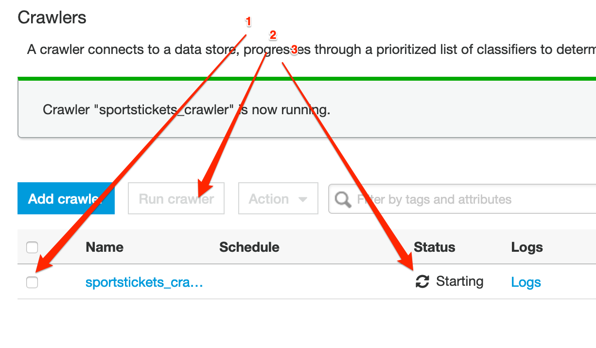

[0-Prerequisites](../00_Prerequisites/README.md) > 1-Ingestion > [2-Orchestration](../02_orchestration/README.md) > [3-Interactive-SQL](../03_interactive_sql_queries/README.md) > [4-Visualisation](../04_visualization_and_reporting/README.md) > [5-Transformations](../05_transformations/README.md)> [99-Conclusion](../99_Wrap_up_and_clean/README.md)

# Lab 01 - Ingestion with Glue

- [Lab 01 - Ingestion with Glue](#lab-01---ingestion-with-glue)
  - [Before you begin](#before-you-begin)
  - [Preparing your environment](#preparing-your-environment)
    - [Configure Permissions](#configure-permissions)
      - [Creating a Policy for Amazon S3 Bucket (Console)](#creating-a-policy-for-amazon-s3-bucket-console)
      - [Creating a Role for AWS Service Glue (Console)](#creating-a-role-for-aws-service-glue-console)
    - [Creating a Development Endpoint and Notebook (First Part)](#creating-a-development-endpoint-and-notebook-first-part)
  - [Create data catalog from S3 files](#create-data-catalog-from-s3-files)
  - [Transform the data to Parquet format](#transform-the-data-to-parquet-format)
  - [Add a crawler for curated data](#add-a-crawler-for-curated-data)
  - [Schema Validation](#schema-validation)
    - [Creating a Development Endpoint and Notebook (Second Part)](#creating-a-development-endpoint-and-notebook-second-part)


In this Lab we will create a schema from your data optimized for analytics and place the result in an S3 bucket-based data lake.

## Before you begin

Please make sure now you select the region where your data resides.
All resources to be created **must** be in the same region.

## Preparing your environment

The encoding of your raw files should be UTF-8. You should export your files from your source with UTF-8 encoding. For this workshop, you may convert the encoding before uploading files to S3 bucket with text editing tools, such as Sublime Text

or by using this Linux command: 
``` python iconv -f <current-encoding of file> -t utf-8 data.csv outputfile.csv```
    
if you don't know the encoding, you can use this command to determine: "
``` python enca -L none data.csv```

Also, before you start, make sure your raw data files are saved in a separate bucket in a folder
called "raw". Each file should be a separate table. Each table file should be preferably in a
separate folder with the table name. An example would be as follows:

```python
/raw/TABLE-NAME-1/LOAD00000001.csv
/raw/TABLE-NAME-1/LOAD00000002.csv
...
/raw/TABLE-NAME-2/LOAD00000001.csv
/raw/TABLE-NAME-2/LOAD00000002.csv
...
```

In this lab we will:

1. Create IAM roles needed for the rest of the labs.
2. Transform the files into Apache Parquet format (https://parquet.apache.org/) using Glue jobs.

### Configure Permissions

#### Creating a Policy for Amazon S3 Bucket (Console)

1. Sign in to the IAM console at https://console.aws.amazon.com/iam/ with your user that has administrator permissions.
2. In the navigation pane, choose Policies.
3. In the content pane, choose Create policy.
4. Choose JSON from the tabs.
5. Paste the following string in the text area. DO NOT FORGET TO PUT YOUR BUCKET NAME INSTEAD OF "YOUR-BUCKET-NAME"

```json
{
  "Version": "2012-10-17",
  "Statement": [
    {
      "Sid": "s0",
      "Effect": "Allow",
      "Action": [
        "s3:PutObject",
        "s3:GetObject",
        "s3:ListBucket",
        "s3:DeleteObject"
      ],
      "Resource": [
        "arn:aws:s3:::YOUR-BUCKET-NAME",
        "arn:aws:s3:::YOUR-BUCKET-NAME/*"
      ]
    }
  ]
}
```

6. When you are finished, choose Review policy
7. Enter the name of policy as “BYOD-S3Policy”

#### Creating a Role for AWS Service Glue (Console)

1. Sign in to the AWS Management Console and open the IAM console at https://console.aws.amazon.com/iam/.
2. In the navigation pane of the IAM console, choose **Roles**, and then choose Create role.
3. For Select type of trusted entity, choose AWS service.
4. Choose **Glue** as the service that you want to allow to assume this role.
5. Choose Next: Permissions.
6. Mark “**AWSGlueServiceRole**” policy as checked to attach to the role.
7. Mark “**BYOD-S3Policy**” policy as checked to attach to the role.
8. Choose Next: Tags.
9. (Optional) Add metadata to the role by attaching tags as key–value pairs. For more information about using tags in IAM, see Tagging IAM Users and Roles.
10. Choose Next: Review.
11. For Role name, enter “**glue-processor-role**”.
12. Review the role and then choose **Create role**.

NOTE: “AWSGlueServiceRole” is an AWS Managed Policy to provide Glue with needed permissions to access S3 data. However, you still need to allow access to your specific S3 bucket for Glue by attaching “BYOD-S3Policy” created policy.

### Creating a Development Endpoint and Notebook (First Part)


In AWS Glue can create an environment—known as a development endpoint—that you can use to iteratively develop and test your extract, transform, and load (ETL) scripts. 
You can then create a notebook that connects to the endpoint, and use your notebook to author and test your ETL script. When you're satisfied with the results of your development process, you can create an ETL job that runs your script. With this process, you can add functions and debug your scripts in an interactive manner.

Go to Glue in the console https://console.aws.amazon.com/glue/

1. On the left menu, click in Dev. endpoints and **Add endpoint**.
2. Development endpoint name: `byod`
3. IAM role: **glue-processor-role**
4. Click **Next**
5. Select Skip networking information
6. Click **Next**
7. Click **Next** \- No need to Add SSH public key for now
8. Click **Finish**

It will take a while to create the endpoint - we will be back to this step. Please continue.

## Create data catalog from S3 files

We will be using AWS Glue Crawlers to infer the schema of the files and create data catalog. Without a crawler, you can still read data from the S3 by a Glue job, but it will not be able to determine data types (string, int, etc) for each column.

- start by navigating to the _Crawlers_ menu on the navigation pane, then press **Add crawler**.
- specify the name: {choose-name}-initial-ds and press **Next**;
- choose _Data stores_ as _Crawler source type_ and press **Next**;
- Choose _S3_ as data store. Add S3 path where your raw data resides and press \*_Next_;
- At this stage we don't add any other data source;
- Choose the _glue-processor-role_ as IAM Role and proceed to the schedule;
- Leave the _Run on demand_ option at the Frequency section and press **Next**;
- Click on the **Add database** button and specify {choose-name}\_src as database name (this will be the name representing the source database in the data catalog). Press **Next** and **Finish**;





- select the newly created crawler and push the **Run crawler** button. It will take a few minutes until it populates the data catalog.

Validation: After the crawler finishes running, from the left menu, go to **Databases**, select your database, and click "Tables in <database-name>" link. Choose the table you just created. You will be able to see information and schema of your files.

## Transform the data to Parquet format

In the following section, we will create one job per each file to transform the data from csv, tsv, xls (typical input formats) to parquet.


We will place this data under the folder named "_curated_" in the data lake.

- In the Glue Console select the **Jobs** section in the left navigation panel'
- Click on the _Add job_ button;
- specify a name (preferably **TABLE-NAME-1-job**) in the name field, then select the _"glue-processor-role"_;
- select Type: **Spark**
- select the option "_A new script to be authored by you_";
- Provide a script name (preferably **TABLE-NAME-1-job-script.py**)
- Tick the checkbox for "_Job Metrics_", under **Monitoring Options** and DO NOT hit **Next** yet;
- Under "Security configuration, script libraries, and job parameters (optional)", set **Maximum capacity** as 20. This determines the number of processing units to be used for the job. Higher numbers result in faster processing times but incur higher costs. This should be determined according to data size, data type etc. (further info can be found in [Glue documentation](https://docs.aws.amazon.com/glue/latest/dg/add-job.html).) - hit **Next**
- click **Next**, then **Save job and edit script**. You will be redirected to script editor.
- Paste the following code to the editor. **DONT FORGET TO PUT IN YOUR INPUT AND OUTPUT FOLDER LOCATIONS.**

This step needs to be done per each file you have.

```python
import sys
import datetime
from awsglue.transforms import *
from awsglue.utils import getResolvedOptions
from pyspark.context import SparkContext
from awsglue.context import GlueContext
from awsglue.job import Job
glueContext = GlueContext(SparkContext.getOrCreate())
job = Job(glueContext)

## DONT FORGET TO PUT IN YOUR INPUT AND OUTPUT LOCATIONS BELOW.
your_database_name = "byod_initial"
your_table_name = "investments_csv"
output_location = "s3://sinan-byod-test/curated2"

job.init("byod-workshop" + str(datetime.datetime.now().timestamp()))

dynamicF = glueContext.create_dynamic_frame.from_catalog(
    database = your_database_name,
    table_name = your_table_name,
    transformation_ctx = "dynamicF")

dynamicF.toDF().write.mode("overwrite").format("parquet").save(output_location)

job.commit()
```

Click \* **Save** and **Run Job**


Check the status of the job by selecting the job and go to history tab in the lower panel. In order to continue we need to wait until this job is done, this can take around 5 minutes (and up to 10 minutes to start), depending on the size of your dataset.


To make sure the job transformed the data, go to S3, you should see a new sub-folder called curated with data on it.

Now, remember to repeat this last step per each file you had originally.

## Add a crawler for curated data

Note: To proceed with this step, you need to wait for the previous job to finish.

Now that we have the data in Parquet format, we need to infer the schema. Repeat this step per each job/ file you created in the previous step.

Glue crawler connects to a data store to determine the schema for your data, and then creates metadata tables in the data catalog.

- start by navigating to the _Crawlers_ menu on the navigation pane, then press **Add crawler**.
- specify the name: {choose-name}-curated-ds and press **Next**;
- choose _Data stores_ as _Crawler source type_ and press **Next**;
- Choose _S3_ as data store. Add S3 path where your curated data resides and press \*_Next_;
- If you have more than one folder (meaning different sets type of data), you need to add them as other datastores one by one in this step. Otherwide, choose "No".
- Choose the _glue-processor-role_ as IAM Role and proceed to the schedule;
- Leave the _Run on demand_ option at the Frequency section and press **Next**;
- Click on the **Add database** button and specify {choose-name}\_src as database name (this will be the name representing the source database in the data catalog - make sure the name does not have "-" since you may have problems in the future steps). Press **Next** and **Finish**;

- select the newly created crawler and push the **Run crawler** button. It will take a few minutes until it populates the data catalog.

## Schema Validation

- In the AWS Glue navigation pane, click Databases > Tables. (You can also click the database name (e.g., "ticketdata" to browse the tables.).
- Within the Tables section of your database, click one table. Please note that each file you had under the bucket /raw is now a different table

You may notice that some tables have column headers such as col0,col1,col2,col3. In absence of headers or when the crawler cannot determine the header type, default column headers are specified. **If this is your case, please follow these steps to resolve**:

- Click Edit Schema on the top right side.
- In the Edit Schema section, double-click col0 (column name) to open edit mode. Type a chosen name, e.g. “id” as the column name.
- Repeat the preceding step to change the remaining column names to match those shown in the following figure.

NOTE: If you have any "id" column as integer, please make sure type is set to "double".

- Click Save.

### Creating a Development Endpoint and Notebook (Second Part)

1. In the glue console, Go to Notebooks, click Create notebook
2. Notebook name: aws-glue-`byod`
3. Attach to development: choose the endpoint created some steps back
4. Create a new IAM Role.
5. **Create notebook**


Now go to lab 2 : [Orchestration](../02_orchestration/README.md)
