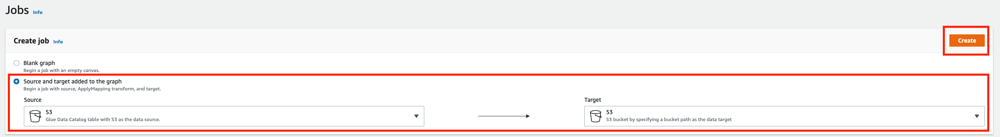
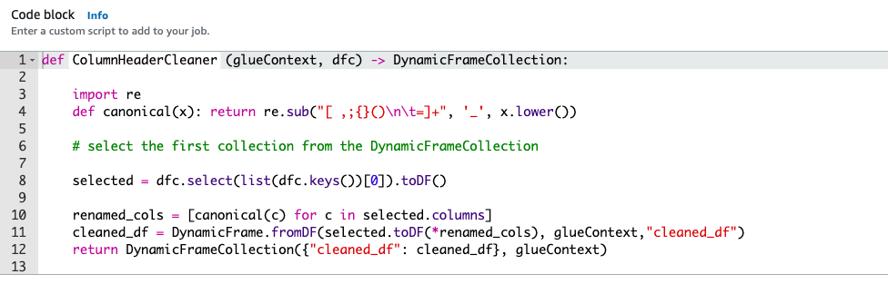
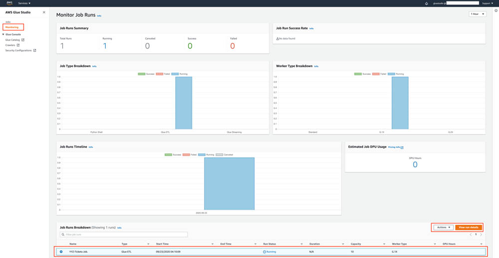

[0-Prerequisites](../00_Prerequisites/README.md) > 1-Ingestion > [2-Orchestration](../02_orchestration/README.md) > [3-Interactive-SQL](../03_interactive_sql_queries/README.md) > [4-Visualisation](../04_visualization_and_reporting/README.md) > [5-Transformations](../05_transformations/README.md)> [99-Conclusion](../99_Wrap_up_and_clean/README.md)

# Lab 01 - Ingestion with Glue

- [Lab 01 - Ingestion with Glue](#lab-01---ingestion-with-glue)
  - [Before you begin](#before-you-begin)
  - [Preparing your environment](#preparing-your-environment)
    - [Configure Permissions](#configure-permissions)
      - [Creating a Policy for Amazon S3 Bucket (Console)](#creating-a-policy-for-amazon-s3-bucket-console)
      - [Creating a Role for AWS Service Glue (Console)](#creating-a-role-for-aws-service-glue-console)
  - [Create data catalog from S3 files](#create-data-catalog-from-s3-files)
  - [Transform the data to Parquet format](#transform-the-data-to-parquet-format)
    - [Adding a source from the catalog](#adding-a-source-from-the-catalog)
    - [Adding transforms](#adding-transforms)
    - [Storing the results](#storing-the-results)
    - [Running the job](#running-the-job)
    - [Monitoring the job](#monitoring-the-job)
  - [Add a crawler for curated data](#add-a-crawler-for-curated-data)
  - [Schema Validation](#schema-validation)

In this Lab we will create a schema from your data optimized for analytics and place the result in an S3 bucket-based data lake.

## Before you begin

Please make sure now you select the region where your data resides.
All resources to be created **must** be in the same region.

## Preparing your environment

The encoding of your raw files should be UTF-8. You should export your files from your source with UTF-8 encoding. For this workshop, you may convert the encoding before uploading files to S3 bucket with text editing tools, such as Sublime Text

or by using this Linux command:

```
python iconv -f <current-encoding of file> -t utf-8 data.csv outputfile.csv
```

if you don't know the encoding, you can use this command to determine:

```
python enca -L none data.csv
```

Also, before you start, make sure your raw data files are saved in a separate bucket in a folder
called "raw". Each file should be a separate table. Each table file should be preferably in a
separate folder with the table name. An example would be as follows:

```python
/raw/TABLE-NAME-1/LOAD00000001.csv
/raw/TABLE-NAME-1/LOAD00000002.csv
...
/raw/TABLE-NAME-2/LOAD00000001.csv
/raw/TABLE-NAME-2/LOAD00000002.csv
...
```

In this lab we will:

1. Create IAM roles needed for the rest of the labs.
2. Transform the files into Apache Parquet format (https://parquet.apache.org/) using Glue jobs.

### Configure Permissions

#### Creating a Policy for Amazon S3 Bucket (Console)

1. Sign in to the IAM console at https://console.aws.amazon.com/iam/ with your user that has administrator permissions.
2. In the navigation pane, choose Policies.
3. In the content pane, choose Create policy.
4. Choose JSON from the tabs.
5. Paste the following string in the text area. DO NOT FORGET TO PUT YOUR BUCKET NAME INSTEAD OF "YOUR-BUCKET-NAME"

```json
{
  "Version": "2012-10-17",
  "Statement": [
    {
      "Sid": "s0",
      "Effect": "Allow",
      "Action": [
        "s3:PutObject",
        "s3:GetObject",
        "s3:ListBucket",
        "s3:DeleteObject"
      ],
      "Resource": [
        "arn:aws:s3:::YOUR-BUCKET-NAME",
        "arn:aws:s3:::YOUR-BUCKET-NAME/*"
      ]
    }
  ]
}
```

6. When you are finished, choose Review policy
7. Enter the name of policy as “BYOD-S3Policy”

#### Creating a Role for AWS Service Glue (Console)

1. Sign in to the AWS Management Console and open the IAM console at https://console.aws.amazon.com/iam/.
2. In the navigation pane of the IAM console, choose **Roles**, and then choose Create role.
3. For Select type of trusted entity, choose AWS service.
4. Choose **Glue** as the service that you want to allow to assume this role.
5. Choose Next: Permissions.
6. Mark “**AWSGlueServiceRole**” policy as checked to attach to the role.
7. Mark “**BYOD-S3Policy**” policy as checked to attach to the role.
8. Choose Next: Tags.
9. (Optional) Add metadata to the role by attaching tags as key–value pairs. For more information about using tags in IAM, see Tagging IAM Users and Roles.
10. Choose Next: Review.
11. For Role name, enter “**glue-processor-role**”.
12. Review the role and then choose **Create role**.

NOTE: “AWSGlueServiceRole” is an AWS Managed Policy to provide Glue with needed permissions to access S3 data. However, you still need to allow access to your specific S3 bucket for Glue by attaching “BYOD-S3Policy” created policy.

## Create data catalog from S3 files

We will be using AWS Glue Crawlers to infer the schema of the files and create data catalog. Without a crawler, you can still read data from the S3 by a Glue job, but it will not be able to determine data types (string, int, etc) for each column.

- start by navigating to the _Crawlers_ menu on the navigation pane, then press **Add crawler**.
- specify the name: {choose-name}-initial-ds and press **Next**;
- choose _Data stores_ as _Crawler source type_ and press **Next**;
- Choose _S3_ as data store. Add S3 path where your raw data resides and press \*_Next_;
- At this stage we don't add any other data source;
- Choose the _glue-processor-role_ as IAM Role and proceed to the schedule;
- Leave the _Run on demand_ option at the Frequency section and press **Next**;
- Click on the **Add database** button and specify {choose-name}\_src as database name (this will be the name representing the source database in the data catalog). Press **Next** and **Finish**;


- select the newly created crawler and push the **Run crawler** button. It will take a few minutes until it populates the data catalog.

Validation: After the crawler finishes running, from the left menu, go to **Databases**, select your database, and click "Tables in <database-name>" link. Choose the table you just created. You will be able to see information and schema of your files.

## Transform the data to Parquet format

In the following section, we will create one job per each file to transform the data from csv, tsv, xls (typical input formats) to parquet.


We will place this data under the folder named "_curated_" in the data lake.

- In the Glue Console select **AWS Glue Studio** 
- On the AWS Glue Studio home page, **Create and manage jobs**


- AWS Glue Studio supports different sources, including Amazon S3, Amazon RDS, Amazon Kinesis and Apache Kafka. For the transformation you will use one AWS table as the data source and one S3 bucket as the destination.

- In the **Create Job** section, select **Source and target added to the graph**. Make sure **S3** is configured as the both the **Source** and **Target** then click **Create**.


This takes you to the Visual Canvas to create an AWS Glue job. You should already see the canvas prepopulated with a basic diagram. 
- Change the **Job name** from **Untitled job** to the desired name (preferably **TABLE-NAME-1-job**) 


### Adding a source from the catalog
1. Select the **Data source - S3** bucket node.
2. On the **Data source properties - S3** tab, choose the relevant Database and table. Leave the partition predicate field empty. 
  
  

### Adding transforms

A transform is the AWS Glue Studio component were the data is modified. You have the option of using different transforms that are part of this service or custom code. 

1. One **ApplyMapping** transform has automatically been added for you. Click it to modify it. 
2. On the **transform** tab, change the data types for specific columns to the desired values. You can also choose to rename columns.
3. Drop the columns that you will not require downstream.


Now we will add a second custom transform to the data source, where we are replacing invalid characters that you may have in your column headers. Spark doesn't accept certain characters in field names including spaces, so it is better to fix this before we send the data down stream. 
1. Click the first **ApplyMapping** transform node.
2. Click the **(+)** icon.


3. On the Node properties tab, for Name enter **Column Header Cleaner**.
4. For Node type, choose **Custom transform**


5. On the Transform tab for Code block, change the function name from MyTransform to **ColumnHeaderCleaner**
6. Enter the following code under the function body:
```    
    import re
    def canonical(x): return re.sub("[ ,;{}()\n\t=]+", '_', x.lower())
    
    # select the first collection from the DynamicFrameCollection
    selected = dfc.select(list(dfc.keys())[0]).toDF()
    
    renamed_cols = [canonical(c) for c in selected.columns]
    cleaned_df = DynamicFrame.fromDF(selected.toDF(*renamed_cols), glueContext,"cleaned_df")
    return DynamicFrameCollection({"cleaned_df": cleaned_df}, glueContext)
```


After adding the custom transformation to the AWS Glue job, you want to store the result of the aggregation in the S3 bucket. To do this, you need a Select from collection transform to read the output from the **Column Header Cleaner** node and send it to the destination.

7. Choose the **New node** node.
8. Leave the **Transform** tab with the default values.
9. On the **Node Properties** tab, change the name of the transform to **Select Aggregated Data**.
10. Leave everything else with the default values.

### Storing the results
1. Select the **Data target - S3 bucket** node
2. Under **Node properties**, change the Node parent to be the **Select Aggregated Data** Transform


3. Under **Data target properties - S3**, select **Parquet** as format and the compression type to be **GZIP**. Select the curated location as the **S3 target location**.


If you followed this guide closely, your final schematic should look similar to the one below: 
 

### Running the job

1. Under Job details, select the _"glue-processor-role"_ as the IAM Role
2. Select Type: **Spark**
3. Make sure Glue version 2 is selected: "Glue 2.0 - Supports spark 2.4, Scala 2, Python 3" (If you want to read more about version 2: [Glue version 2 announced](https://aws.amazon.com/blogs/aws/aws-glue-version-2-0-featuring-10x-faster-job-start-times-and-1-minute-minimum-billing-duration/))
4. Check that **G.1x** is selected as the worker type and that **Worker type** and that **Number of workers** is "10". This determines the worker type and the number of processing units to be used for the job. Higher numbers result in faster processing times but may incur higher costs. This should be determined according to data size, data type etc. (further info can be found in [Glue documentation](https://docs.aws.amazon.com/glue/latest/dg/add-job.html).)


5. Click **Save** and **Run Job**

### Monitoring the job
AWS Glue Studio offers a job monitoring dashboard that provides comprehensive information about your jobs. You can get job statistics and see detailed info about the job and the job status when running.

In the AWS Glue Studio navigation panel, choose Monitoring.
Choose the entry with the job name you have configured above.
To get more details about the job run, choose View run details.



Wait until **Run Status** changes to **Succeeded**. This can take up to several minutes, depending on the size of your dataset.


**NOTE: Now, remember to repeat this create job step for each file you had originally.**

## Add a crawler for curated data

Note: To proceed with this step, you need to wait for the previous job to finish.

Now that we have the data in Parquet format, we need to infer the schema. Repeat this step per each job/ file you created in the previous step.

Glue crawler connects to a data store to determine the schema for your data, and then creates metadata tables in the data catalog.

- start by navigating to the _Crawlers_ menu on the navigation pane, then press **Add crawler**.
- specify the name: {choose-name}-curated-ds and press **Next**;
- choose _Data stores_ as _Crawler source type_ and press **Next**;
- Choose _S3_ as data store. Add S3 path where your curated data resides and press \*_Next_;
- If you have more than one folder (meaning different sets type of data), you need to add them as other datastores one by one in this step. Otherwide, choose "No".
- Choose the _glue-processor-role_ as IAM Role and proceed to the schedule;
- Leave the _Run on demand_ option at the Frequency section and press **Next**;
- Click on the **Add database** button and specify {choose-name}\_curated as database name (this will be the name representing the curated database in the data catalog - make sure the name does not have "-" since you may have problems in the future steps). Press **Next** and **Finish**;

- select the newly created crawler and push the **Run crawler** button. It will take a few minutes until it populates the data catalog.

## Schema Validation

- In the AWS Glue navigation pane, click Databases > Tables. (You can also click the database name (e.g., "ticketdata" to browse the tables.).
- Within the Tables section of your database, click one table. Please note that each file you had under the bucket /raw is now a different table

You may notice that some tables have column headers such as col0,col1,col2,col3. In absence of headers or when the crawler cannot determine the header type, default column headers are specified. **If this is your case, please follow these steps to resolve**:

- Click Edit Schema on the top right side.
- In the Edit Schema section, double-click col0 (column name) to open edit mode. Type a chosen name, e.g. “id” as the column name.
- Repeat the preceding step to change the remaining column names to match those shown in the following figure.

NOTE: If you have any "id" column as integer, please make sure type is set to "double".

- Click Save.

Now go to lab 2 : [Orchestration](../02_orchestration/README.md)


