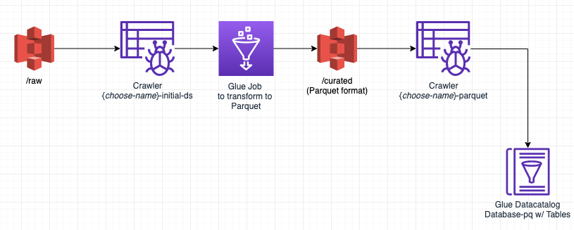

[0-Prerequisites](../00_Prerequisites/README.md) > [1-Ingestion](../01_ingestion_with_glue/README.md) > 2-Orchestration > [3-Interactive-SQL](../03_interactive_sql_queries/README.md) > [4-Visualisation](../04_visualization_and_reporting/README.md) > [5-Transformations](../05_transformations/README.md) > [99-Conclusion](../99_Wrap_up_and_clean/README.md)

# Lab 2 Orchestrating the data pipeline

- [Orchestrate the data pipeline using the Workflow feature](#orchestrate-the-data-pipeline-using-the-workflow-feature)
  - [Reviewing the results](#reviewing-the-results)
- [Orchestrate YOUR data pipeline using Workflows](#orchestrate-your-data-pipeline-using-workflows)

In this lab we will continue to work with [Glue](https://aws.amazon.com/glue/) and convert the raw data we have extracted in [the previous lab](../01_ingestion_with_glue/README.md) into a curated data set by making some automation.

> **Please note**: this Lab depends on the steps executed in the [Transformation](../01_ingestion_with_glue/README.md) LAB;
> In case you didn't finish that one yet, now is the time :)

At this stage we have Glue Jobs configured to convert our raw data into Parquet. We should be able to observe 2 main folders in our data-lake bucket (raw and curated).

## Orchestrate the data pipeline using the Workflow feature

When you only have a Glue job or a single Crawler that needs to be run periodically, you can schedule it with Glue scheduler or maybe you can use Amazon CloudWatch events with a Lambda function. But if you need more complex flows - for example chaining multiple jobs and crawlers, running different jobs in parallel - Glue provides a workflow mechanism.

The example presented here assumes a lineal/ dependant approach - some jobs before running the others. The plan is to create a pipeline, which will refresh the data-set every once in a while.

Another example of dependent jobs are jobs that extracts data from other source and ingest it into your data lake before kicking off another transformation jobs.

For this basic example we decided to automate the following steps:

* Transform data into parquet
* Crawl Parquet/ curated data

The first three steps were done in the previous part. The updated diagram of what we did including the crawler should look something like this:

Now, let's automate this process so we don't have to worry about it...

Once we are done, it should look something like this:

Let's get started - navigate to the *Workflows* in the *ETL* section on the left side-pane.

* we start by clicking on the **Add Workflow** button;
* add a name for our workflow (e.g. `byod`) and press the **Add Workflow** button;

Now, in the new created workflow, please click on **Add Trigger**

* Make sure you select the *Add New* tab;
* Define a *Name* for the new trigger (`trigger-crawler-rawdata`);
* Trigger Type - Schedule

Now, let's specify the *Frequency* before you press **Add** (let's say you run this workflow once a day);

Now, we need to configure the job that is going to be triggered. Click **Add Node**

Select the crawler that needs to run first- In this case, we want the raw data crawler created in the first step (you probably named it **{choose-name}-initial-ds**), then click **Add**.

Until this point it should look something like this 

now, we need to set up the job that converts data into parquet. For that please click on the crawler (byod-ds in the image) and then click in **Add Trigger**

Repeat the creation of the trigger
Note: Make sure you select Add new at the top and give it a name (trigger-job-parquet). The trigger type Event should be already selected and the option Start after ANY watched event as well. After done, it should look something like this

Click on the trigger and then **Add Node**

Select the job that needs to run - In this case, we want the transformation job created in the first step (you probably named it **TABLE-NAME-1-job**), then click **Add**.

We are almost there, however there's one more thing: we need to add the crawler for the curated data - Please follow the same steps

Click on the byod job and then click in **Add Trigger**.

Make sure you Add new one. Choose a name and the trigger to be **Event**

For the Event, we want that after the previous job is done (SUCCESS) then trigger the crawler

Now, please click on the trigger, and then **Add Node**.

Add a job to be triggered (In this case the crawler created in the previous step - you probably named it something like this {choose-name}-curated-ds)

### Reviewing the results

Once we are ready, we can try out the workflow by clicking on **Run** in the **Actions** menu.

> Once you selected a job, you can monitor the execution status in the *History* TAB in the bottom panel; If the job(s) succeeded, visit the *Metrics* TAB to see resource utilisation and data movement information; Also note that the jobs can take quite a bit of time to end, about 15 minutes in total.

When jobs succeed, you should find in your S3 bucket a folder called *curated* with subfolders for all your tables.

By selecting the latest Job and clicking on the **View run details** you can monitor the execution results of the data processing pipeline:

Once the pipeline succeeded at least once, we should be able to observe the newly created databases in the data catalog.

When you navigate to the **Tables**, you will observe tables created from your data files.

"What can I do with it?", you may wonder. Stay tuned, we will cover this in great details in the next session.

## Orchestrate YOUR data pipeline using Workflows

We just walked you through an example, now its time you think about your own workflow case. Which are those jobs that have to run on a recurring/ schedule basis? 
Please note that this was a lineal job, but you can run some jobs in parallel, you can add them in parallel in the pipeline.
Think about how your workflow will look like, you can ask help to one of the support members from AWS.

Now go to lab 3 : [Interactive SQL Queries](../03_interactive_sql_queries/README.md)
