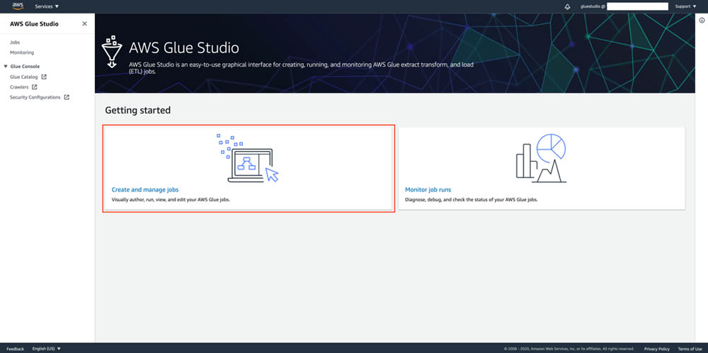
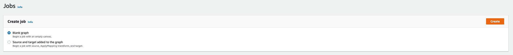
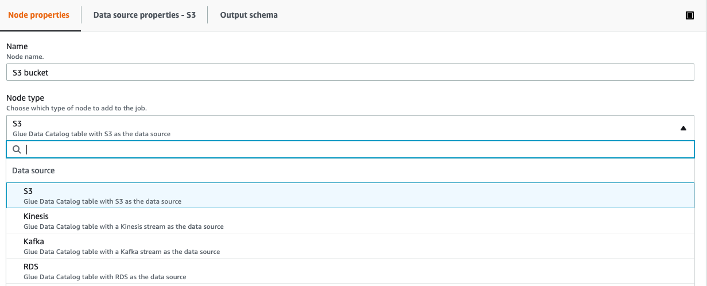
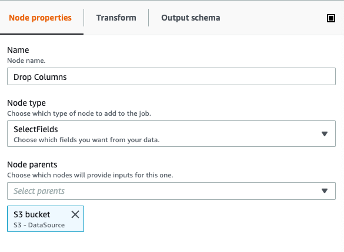
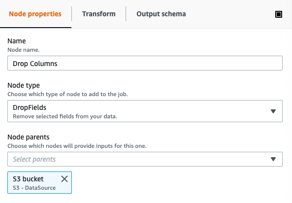
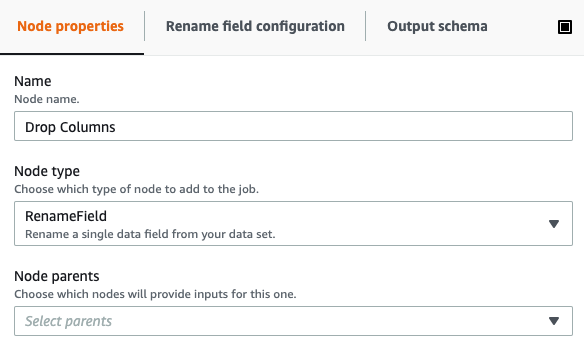
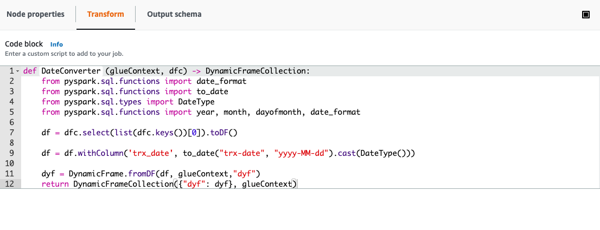

[0-Prerequisites](../00_Prerequisites/README.md) > [1-Ingestion](../01_ingestion_with_glue/README.md) > [2-Orchestration](../02_orchestration/README.md) > [3-Interactive-SQL](../03_interactive_sql_queries/README.md) > [4-Visualisation](../04_visualization_and_reporting/README.md) > 5-Transformations > [99-Conclusion](../99_Wrap_up_and_clean/README.md)

# Lab 05 - Transformations

- [Lab 05 - Transformations](#lab-05---transformations)
  - [Accessing Glue](#accessing-glue)
  - [Transformations](#transformations)
    - [Altering the Columns](#altering-the-columns)
    - [Convert to Time stamp](#convert-to-time-stamp)
      - [Example NY Taxis dataset](#example-ny-taxis-dataset)
  - [Partitioning](#partitioning)
  - [Other time formats](#other-time-formats)


Below are some considerations for cleaning, transforming, aggregating and partitioning data. For development and debugging purposes Glue Studio, just like we did a few steps back. 

## Accessing Glue

- In the Glue Console select **AWS Glue Studio** 
- On the AWS Glue Studio home page, **Create and manage jobs**



- Select **Blank graph** and click **Create**



Create a new node by clicking **(+)** and select its type to be **Data source - S3**.



Point it to the desired source data.

## Transformations

You probably have a large number of columns and some of them can have complicated names. To analyze the data, perhaps we may not need all the columns, just a small set of them, and to make easier to recall, we may want to change the name of the columns. Therefore, we are going to select only the columns we are interested in, drop the rest of them and we are going to rename them.

### Altering the Columns

There are two different ways to drop columns from your data:

1. You use the **SelectFields** method to drop all the columns and keep just the ones you need



2. You use the **DropFields** node to keep all the columns and just drop the ones you do not need. 



You can also use the **RenameField** node to rename columns. This should be invoked for each column you want to rename.



### Convert to Time stamp

Please check the datetime column schema, from the previous step. It may be string or another type different than what we may need it to be. Therefore, we are going to do some transformations.

We will achieve this using a custom transform.
1. Click the first last node in your schema.
2. Click the **(+)** icon.
3. On the Node properties tab, for Name enter **Date Converter**.
4. For Node type, choose **Custom transform**
5. On the Transform tab for Code block, change the function name from MyTransform to **DateConverter**
6. Enter the following code under the function body:

First, let's add the libraries we need to make this conversion:

``` python  
    from pyspark.sql.functions import date_format
    from pyspark.sql.functions import to_date
    from pyspark.sql.types import DateType
    from pyspark.sql.functions import year, month, dayofmonth, date_format
```

Then, depending on the format of our current field, we may want to convert it into another format that contains year and month only. This will allow us later to partition our data according to year and month easily. Select which line of code you will use according to your date type format.

**Dynamic Frame vs Spark/ Data frames** One of the major abstractions in Apache Spark is the SparkSQL DataFrame, which is similar to the DataFrame construct found in R and Pandas. A DataFrame is similar to a table and supports functional-style (map/reduce/filter/etc.) operations and SQL operations (select, project, aggregate).

DataFrames are powerful and widely used, but they have limitations with respect to extract, transform, and load (ETL) operations. Most significantly, they require a schema to be specified before any data is loaded. To address these limitations, AWS Glue introduces the DynamicFrame. A DynamicFrame is similar to a DataFrame, except that each record is self-describing, so no schema is required initially. Instead, AWS Glue computes a schema on-the-fly when required, and explicitly encodes schema inconsistencies using a choice (or union) type.

It is possible to convert a DataFrame to a DynamicFrame and vice versa with toDF() and fromDF() methods.

First, we need to change the format from dynamic frame collection to dataframe. This will allow us to use some the libraries previously imported. 
``` python 
df = dfc.select(list(dfc.keys())[0]).toDF()
```

**ISO 8601 TIMESTAMP**
Below is example code that can be used to do the conversion from ISO 8601 date format. Please substitute your own date-format in place of yyyy-MM-dd

``` python 
## Adding trx_date date column with y-M format converting a current timestamp/unix date format
df = df.withColumn('trx_date', to_date("trx-date", "yyyy-MM-dd").cast(DateType()))
```

If you do not get an error but the date column is full of NULL, then probably you didn't substitute your own date-format in yyyy-MM-dd
If you still have errors, then please go to the other date formats section.

#### Example NY Taxis dataset

``` python 
## Adding pickup_datetime date column with yyyy-MM-dd format converting a current timestamp/unix date format
df = df.withColumn('pickup_datetime', to_date("pickup_datetime", "yyyy-MM-dd")).cast(DateType()))
df.show()
```

Finally, convert the DataFrame back to a Dynamic Frame and return the required Dynamic Frame Collection:
``` python 
    dyf = DynamicFrame.fromDF(df, glueContext,"dyf")
    return DynamicFrameCollection({"dyf": dyf}, glueContext)
```    

If you followed along with this guide, your custom code should look similar to the following:



## Partitioning

Partitioning the data greatly increases the performance of your queries and reduce costs. For example, if you only need last month's data from a large dataset, if the data is partitioned by day, month and year, then you can use a "where" clause in your query and Athena will only use relevant folders and will not scan the unnecessary ones.

In order to partition the data, you can add one or multiple partition keys when writing the data to S3 using the output node in Glue Studio. You can try creating separate columns for year, month and day to use as partitions. Then, the final folder structure will be like:

```
/curated/TABLE-NAME-1/year=YYYY/month=MM/day=DD/file1.parquet
```

You can also add additional partitions if you know you will often use those fields to filter data. For example, if you will often filter your data on product types, you can add a column for that field and also partition by that column additionally.

Add this code to your custom script, before converting the data frame back into a dynamic frame:
```python

df = df.withColumn('year', year(df.trx_date)).withColumn('month', month(df.trx_date)).withColumn('day', dayofmonth(df.trx_date))
```

See that there are three extra fields for year, month and day - If you want, you can also drop the original "trx_date" column using ```df.drop('trx_date')```. Alternatively, once you convert the data frame back to a dynamic frame, you can use a *Drop Fields* node transformation as introduced earlier.

## Other time formats

Now, depending on the time format, please select which line of code you will use according to your date type format.

**UNIX TIMESTAMP**

``` python
## Adding trx_date date column with yyyy-MM-dd format converting a current timestamp/unix date format
df = df.withColumn('trx_date', date_format(from_unixtime(df['{YOUR_DATE_COL_NAME}']), "yyyy-MM-dd").cast(DateType()))
```

**OTHER DATE FORMATS**

To convert unique data formats, we use to_date() function to specify how to parse your value specifying date literals in second attribute. You can read the reference for date literals here: https://spark.apache.org/docs/latest/sql-ref-datetime-pattern.html.

``` python
## Adding trx_date date column with yyyy-MM-dd format converting a current timestamp/unix date format
df = df.withColumn('trx_date', date_format(to_date(df['{YOUR_DATE_COL_NAME}'], {DATE_LITERALS}), "yyyy-MM-dd").cast(DateType()))
```

Now go to last lab : [Wrap up and Clean](../99_Wrap_up_and_clean/README.md)


